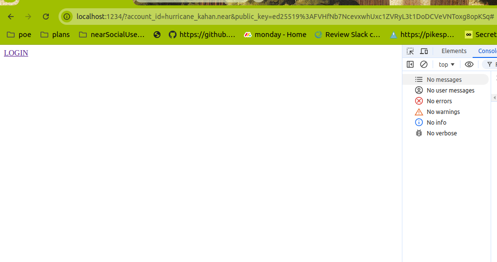
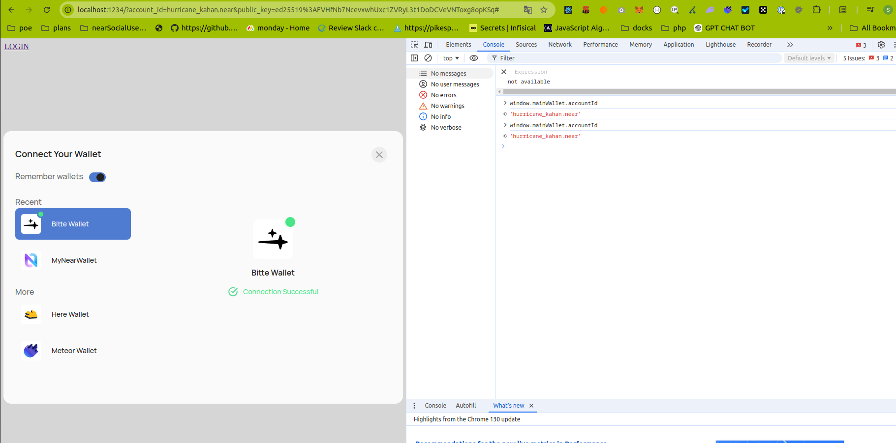
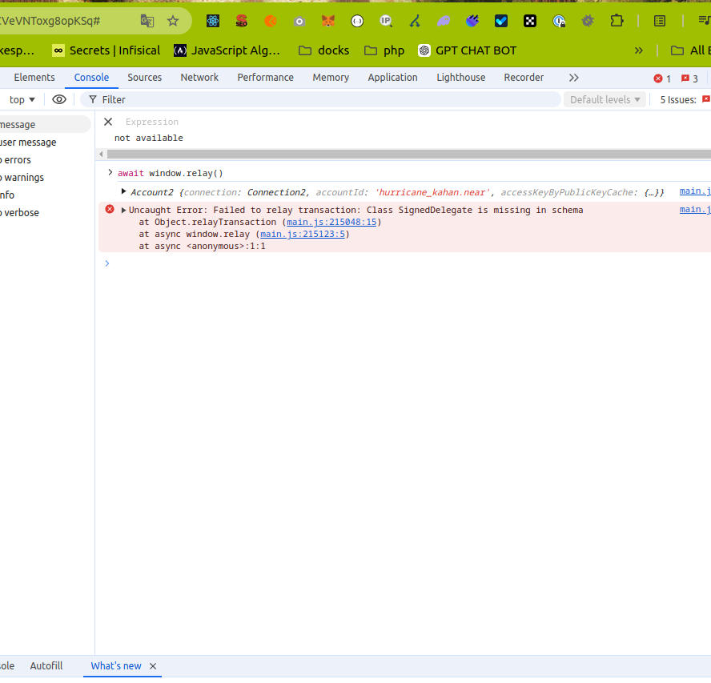

node -v
v20.10.0

1) npm i --force
2) cd ./fe npm i 
3) cd . npm run vb
3) cd ./public and find in main  const bitteApiKey = define_process_env_default2.BITTE_API_KEY; manually replace it with
   const bitteApiKey = 'de94d8ca0f83d0221ee6e0e33984733c1bb0f16cd48d342472c373e2792ee164'; (.env not used for now)
4) cd ./fe npm start, you should see Server running at http://localhost:1234
5)  
6) 
8) Run await window.relay() in browser console
9) 

You will se an issue here:
transactions_12.encodeSignedDelegate)(signedDelegate2);
function serializeStruct(schema2, obj, writer) {    if (typeof obj.borshSerialize === "function") {
obj.borshSerialize(writer);      return;
}    const structSchema = schema2.get(obj.constructor);
if (!structSchema) { throw new BorshError(`Class ${obj.constructor.name} is missing in schema`) };

Parcel used to show how it works as bundled script that is used in original code. Also contract is actual, and there are a private key from account with 1 near for tests